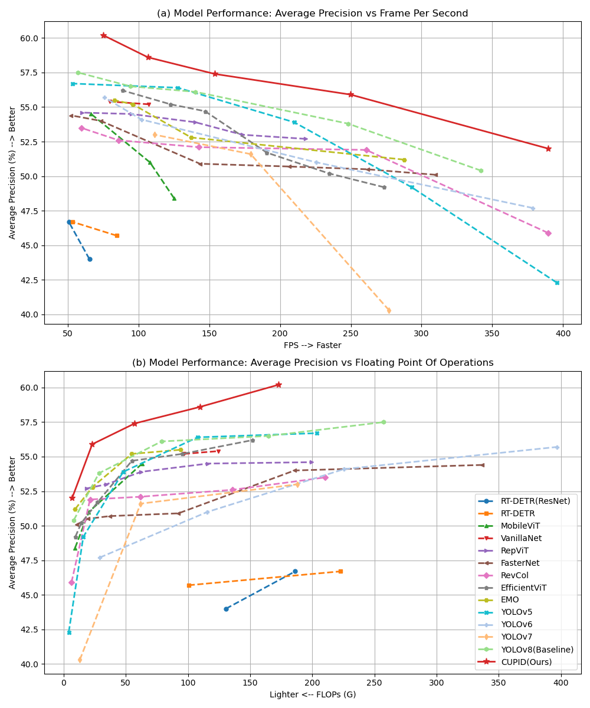
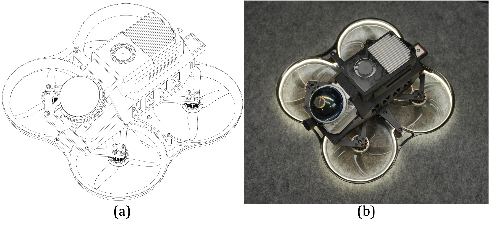

# Lightweight yet High-Performance Defect Detector for UAV-Based Large-Scale Infrastructure Real-Time Inspection

## Result of our work
#### Benchmark performance comparison


#### CU-Astro: compact but long-duration UAV


#### Video demonstration [▶️ Watch CU-Astro inspection demonstration video](https://drive.google.com/file/d/1aF60K5ictHUmy_rjEovKXsbXMP1cjLZ5/view?usp=drive_link)

## Usage of this repository
### Install
```python
# Conda environment
conda create -n cupid python=3.9
conda activate cupid

# Install ultralytics
# Our version is 8.1.9 which can be found in ./ultralytics/__init__.py
pip install ultralytics, tide, pycocotools
```

### Train
```python
# Single GPU training
python train.py > logs/CUPIDn-train.log 2>&1 & tail -f logs/CUPIDn-train.log

# Multi-GPUs training
python -m torch.distributed.run --nproc_per_node 2 train.py > logs/CUPIDn-train.log 2>&1 & tail -f logs/CUPIDn-train.log
```

### Validate / Test
```python
# Ultralytics framework validation / test
python val.py > logs/CUPIDn-val(test).log 2>&1 & tail -f logs/CUPIDn-val(test).log

# TIDE framework validation /test 
python TIDE-frame.py --anno_json=your_gt_json_path --pred_json=your_pred_json_path 
```

### Transform the model
```python
# Fuse CUPID_Aux without any loss
# 'model_PGI_weights_path' is the trained weight of the CUPID (with CUPID_Aux) model
# 'model_cfg_path' is the config file of the CUPID-no-aux (without CUPID_Aux) model
# 'layer_num', 'aux_layer_num' represent the detect head layer number of the CUPID-no-aux and CUPID, respectively

# Fused weight will be save in the same path as the best weight of CUPID model
python transform_aux.py 
```

### Output of the model
```python
# Export the model to ONNX format for further deployment
python export.py
```

### Inference 
```python
# Predict unknown images / videos
python detect.py 
```

### Dataset in our work can be available at: <button style="background-color: #000000; color: white; margin: 0 auto; padding: 10px 15px;border: none; border-radius: 5px;"><a href="https:onedrive" style="color: white; text-decoration: none;">OneDrive</a> </button>, <button style="background-color: #000000; color: white; margin: 0 auto; padding: 10px 15px;border: none; border-radius: 5px;"><a href="https:baidu" style="color: white; text-decoration: none;">BaiduNet</a> </button>


## Acknowledgement
This work was supported by the InnoHK of the Government of the Hong Kong Special Administrative Region via the Hong Kong Centre for Logistics Robotics.


## Citation
If you find this project helpful for your research, please consider citing our paper and giving a ⭐ of this repository.

Any questions or academic discussion, please contact me at: byzhao@mae.cuhk.edu.hk

<!-- ```BibTex
@article{ZHAO2024105405,
title = {High-resolution infrastructure defect detection dataset sourced by unmanned systems and validated with deep learning},
journal = {Automation in Construction},
volume = {163},
pages = {105405},
year = {2024},
issn = {0926-5805},
doi = {https://doi.org/10.1016/j.autcon.2024.105405},
author = {Benyun Zhao and Xunkuai Zhou and Guidong Yang and Junjie Wen and Jihan Zhang and Jia Dou and Guang Li and Xi Chen and Ben M. Chen},
}
``` -->
